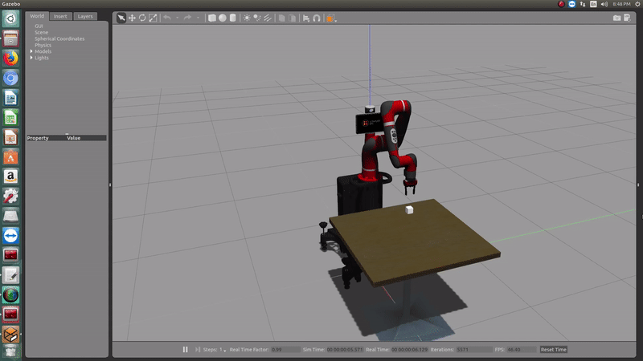

# sawyer_tufts

## Installation Instruction:
- If ROS is not installed, follow the instructions in the link below:
> http://wiki.ros.org/ROS/Installation
- If sawyer simulation is not installed, please follow the instructions in the link below:
> http://sdk.rethinkrobotics.com/intera/Gazebo_Tutorial
- Locate the the file "intera.sh", open and ennsure the ros_version matches the ros version you insatalled. Modify if need.
- Move the "intera.sh" file to workspace directory.
- Clone this repo into the src of your workspace.
- make the workspace.

## Introduction:
This package when ran launches gazebo world, a table and a specified block on the table via a python script. The user specifies the block's serial number(0 through 4) and the number of times to run the code. The joint_state is recorded into a rosbag. The naming convention for the rosbag file is:
>                     <sawyer_model>_<Block number>_<Time stamp>.bag
example:
>                      sawyer_model_4_2018-08-01-14-25-14.bag

## Run:
To run the code, the user runs the following in the commandline:
>                     roslaunch sawyer_tufts pick_and_place_tufts.launch num_of_run:="natural number"
example:
>                     roslaunch sawyer_tufts pick_and_place_tufts.launch num_of_run:=4
 
where:
- sawyer_tufts                -> the name of package
- pick_and_place_tufts.launch -> the launch file for the gazebo world and the demo python script
- num_of_run                  -> number of desired time the robot should pick block. Number should be greater than

## Demos:

### Grasp, Pick, Hold, Shake and Place(Gif):

### Pick and Place(Full Video):

